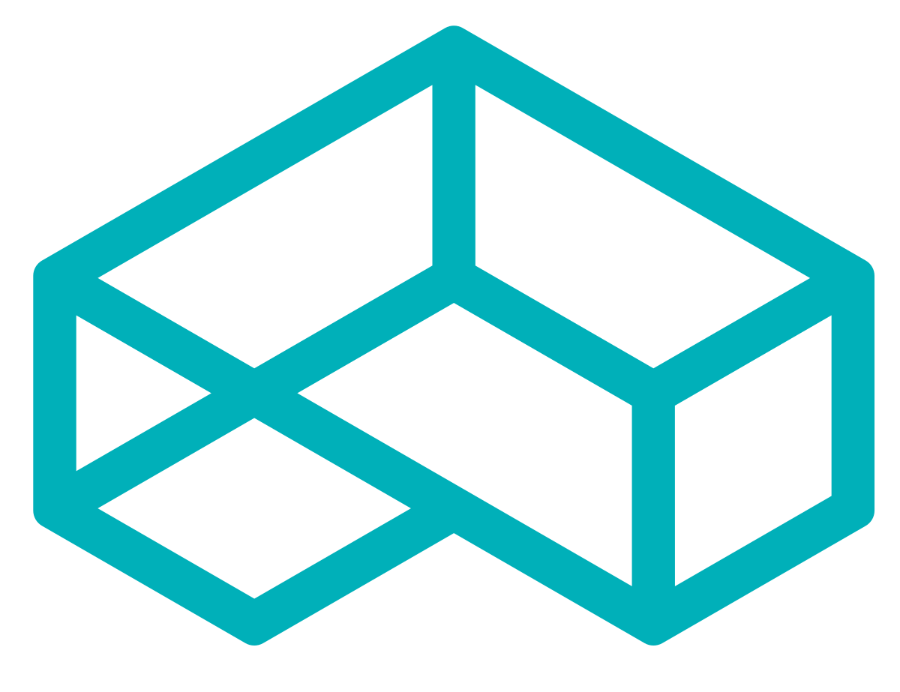

<!-- header -->

    

    <!-- Header -->
        
        <h2>Patterns</h2>
        
<i>Template Design Patterns in Python</i>

    

    

    <!-- Shields -->
        
        
        
        
        
        
    

    

    <!-- Links -->
        <a href="#demo">View Demo</a>
        ·
        <a href="https://github.com/armckinney/design-patterns/issues/new/choose">Report Bug</a>
        ·
        <a href="https://github.com/armckinney/design-patterns/issues/new/choose">Request Feature</a>
    

 
 

<!-- Description -->
*Generic Design Patterns in Python*

For specifics on various patterns included, see the [docs](/docs/pattern_overview.md).

- Based on information outlined in *Design Patterns* by Erich Gamme, Richard Helm, Ralph Johnson, and John Vlissides.
- Special thanks to those at [refactoring.guru](https://refactoring.guru/) for their excellent python examples and further explanations.
